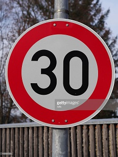

# **Traffic Sign Recognition using a Neural Net**

## Writeup

### Build a Traffic Sign Recognition Neural Network

The goals / steps of this project were the following:
* Load the data set (see below for links to the project data set)
* Explore, summarize and visualize the data set
* Design, train and test a model architecture
* Use the model to make predictions on new images
* Analyze the softmax probabilities of the new images

#### The Jupyter Notebook containing the implemented network can be found [here](Traffic_Sign_Classifier.ipynb).

### Data Set Summary & Exploration

* The size of training set is 34799
* The size of the validation set is 4410
* The size of test set is 12630
* The shape of a traffic sign image is 32 x 32 pixels, with RGB channels
* The number of unique classes/labels in the data set is 43

#### Exploratory visualization of the dataset

For any sort of data classification problem, it's helpful if the provided dataset
has an equal distribution of classes. Unfortunately, this is not the case here:


As you can see, some classes have 2,000+ images, and some have barely 200. This
may prove to be an issue during training.

As a simple way to combat this, the excellent Jeremy Howard recommends simply duplicating the smaller data sets to create a more equal distribution. There are also more sophisticated methods to deal with this, such as image rotation, blurring, flipping, etc. However, I was able to achieve 95%+ validation accuracy with the original unbalanced dataset, so it turned out to be not so significant.

### Design and Test a Model Architecture


#### Preprocessing

Tensorflow provides several useful image modification methods. Based on the [original paper's](http://yann.lecun.com/exdb/publis/pdf/sermanet-ijcnn-11.pdf) recommendation, I decided to convert all images to grayscale. I also used data normalization to create a dataset with equal mean and zero variance, and that increased the validation accuracy by several percent.

If additional data was needed, this would be an excellent way to create it -- I could use blurring and rotating to create subtly different images of the same label and train the network using the new data.

#### Network Architecture

My final model consisted of the following layers:

| Layer                 |     Description                               |
|:---------------------:|:---------------------------------------------:|
| Input                 | 32x32x1 RGB image                             |
| Convolution 5x5       | 1x1 stride, valid padding, outputs 28x28x6    |
| RELU                  |                                               |
| Max pooling           | 2x2 stride, outputs 14x14x6                   |
| Convolution 5x5       | 1x1 stride, valid padding, outputs 10x10x16   |
| RELU                  |                                               |
| Max pooling           | 2x2 stride, outputs 5x5x16                    |
| Flatten               | Outputs 400                                   |
| Dropout               | 50% keep probability during training          |
| Fully connected       | Outputs 120                                   |
| RELU                  |                                               |
| Dropout               | 50% keep probability during training          |
| Fully connected       | Outputs 84                                    |
| RELU                  |                                               |
| Dropout               | 50% keep probability during training          |
| Fully connected       | Final layer, outputs 43                       |


Adding several dropout layers had a significant boost to the validation accuracy of the network, from ~90% to ~95%.

#### Training and Hyperparameters

To train the model, I used the following hyperparameters:

```
EPOCHS = 30
BATCH_SIZE = 128
LEARNING_RATE = 0.001
```

I tried several other similar learning rates without better results.

I used the Adam Optimizer, which does learning rate decay automatically. This is convenient, and I don't need to worry about adding it manually.

#### Approach

My model is based on the LeNet architecture. LeNet is an excellent starter network, and trains very quickly. As this was my introduction to Tensorflow, I wanted to keep the size and variables at a manageable scale. LeNet is also a highly optimized CNN, making it easy to achieve good results.

I tried several strategies for data preprocessing using numpy to manually modify the pixels. This had decent results, but was also very computationally expensive. Accessing each pixel in a 50,000 image dataset isn't a great practice, and definitely doesn't scale very well.

I also tuned the hyperparameters, doubling and halving the batch size, and increasing the epochs up to 50. I also tried learning rates such as 0.002, 0.0015, 0.005, etc. However, none of these gave superior results than the current set I'm using.

The internal network dimensions were also tweaked -- however, the biggest benefit by far was seen from adding dropout layers.

My final model results were:
* training set accuracy of 100% (overfitting! More dropout might be helpful)
* validation set accuracy of 95.0%
* test set accuracy of 92.4%

Based on these numbers and with minimal data preprocessing, it seems that the LeNet architecture works quite well.

### Test a Model on New Images

#### New Images from Google

Here are five German traffic signs that I found on the web:




These signs are nonideal, as they are significantly cleaner than the images I have seen in the original dataset, and are also watermarked. It'll be interesting to see how the network handles them.

#### Prediction on new images

Here are the results of the prediction:

| Image                 |     Prediction                                |
|:---------------------:|:---------------------------------------------:|
| 30 km/h               | 30 km/h                                       |
| Stop sign             | Stop sign                                     |
| Road work             | Road work                                     |
| Turn right ahead      | Priority road                                 |
| Roundabout mandatory  | Priority road                                 |

3 our of the 5 images were correctly classified: 60% accuracy.

Interestingly, the model incorrectly predicted both sign 4 and 5 to be a priority road sign. Looking at the included `csv` file and checking the class representation histogram, we can see that Priority road is class 12. The histogram shows that class 12 is heavily overrepresented, which may be why it was misclassified.

#### Prediction of the five new images

*First Image*

For the first image, the model is quite sure that this is a 30km/h sign (probability of 0.78), and the image does contain a 30km/h sign. The top five soft max probabilities were:

| Probability           |     Prediction                                |
|:---------------------:|:---------------------------------------------:|
| .78                   | 30km/h                                        |
| .05                   | 70km/h                                        |
| .05                   | 50km/h                                        |
| .03                   | 80km/h                                        |
| .02                   | 20km/h                                        |

The classifier was obviously very confident that the image was a speed limit sign of some sort.

*Second Image*

The model successfully classifies the image as a Stop sign with a high degree of certainty.

| Probability           |     Prediction                                |
|:---------------------:|:---------------------------------------------:|
| .82                   | Stop                                          |
| .08                   | Turn left ahead                               |
| .05                   | Keep right                                    |
| .009                  | Ahead only                                    |
| .008                  | Yield                                         |

*Third Image*

The model is rather unconfident here -- it manages to successfully classify the image as Road Work, but the Double Curve sign is a close competitor.

| Probability           |     Prediction                                |
|:---------------------:|:---------------------------------------------:|
| .56                   | Road work                                     |
| .36                   | Double curve                                  |
| .03                   | Beware of ice                                 |
| .009                  | Dangerous left curve                          |
| .007                  | Wild animal crossing                          |

*Fourth Image*

The model is the most unconfident here, with only 18% confidence in its pick. The top five picks only sum up to be 53%, meaning that almost half of its prediction is spent further on down the line. Instead of a clean pick, the model is scattering its prediction across a great deal of classes. This is a great example of something the model has a lot of trouble with.

| Probability           |     Prediction                                |
|:---------------------:|:---------------------------------------------:|
| .18                   | Priority road                                 |
| .12                   | Roundabout mandatory                          |
| .09                   | Right-of-way at the next intersection         |
| .07                   | Turn left ahead                               |
| .07                   | Beware of ice                                 |

*Fifth Image*

The model is the most confident out of all the five images. Unfortunately, it is confidently wrong. It think the sign is "Priority road", but it really is "Roundabout mandatory". It only gave "Roundabout mandatory" a 4% score.

It's interesting to visually compare the 5th and 4th images -- they're somewhat similar, the only difference being the arrows. And yet, that's plenty of difference to the model: we see a massive difference in prediction distribution.

| Probability           |     Prediction                                |
|:---------------------:|:---------------------------------------------:|
| .83                   | Priority road                                 |
| .04                   | Roundabout mandatory                          |
| .04                   | No entry                                      |
| .01                   | 30km/h                                        |
| .01                   | Yield                                         |

### Closing

This was a great "Hello World" to neural nets. I was simultaneously introduced to their power and the confusion that comes when training it. I now have a bit more understanding of what people mean when they say it's a black box -- but more importantly, I have a bit more understanding of how that black box works. I was skeptical of dropout layers at first, but my biggest regret is not adding them sooner. I didn't think they'd help, but I was amazed at how much they did.

I'll be doing a lot more deep learning in the next few months, and I'm very excited to continue this journey with Udacity and USF.
